# RLM Task Orchestration System (DAG-Based)

## Overview

The RLM Task Orchestration System uses a **Directed Acyclic Graph (DAG)** to model task dependencies and automatically calculate which tasks are ready for parallel execution. This enables intelligent, dependency-aware batch processing with optimal parallelization.

## Architecture

### Components

1. **Task Graph Builder** (`build-task-graph.ps1`)
   - Reads all task files from `RLM/tasks/active/`
   - Parses YAML frontmatter for dependencies
   - Builds adjacency list representation (nodes + edges)
   - Validates graph is acyclic (no circular dependencies)
   - Outputs JSON graph to `RLM/progress/task-graph.json`

2. **Readiness Calculator** (`calculate-ready-tasks.ps1`)
   - Loads task graph
   - Applies readiness algorithm (all dependencies completed?)
   - Prioritizes by priority/dependency-count
   - Groups tasks by assignee for parallel spawning
   - Outputs ready tasks to `RLM/progress/ready-tasks.json`

3. **Graph Visualizer** (`visualize-task-graph.ps1`)
   - Generates Mermaid diagram from task graph
   - Color-codes by status (green=completed, yellow=active, red=blocked, blue=pending)
   - Shows priority indicators
   - Outputs `.mmd` and `.md` files for viewing

## Concepts

### Task as a Node

Each task is a node in the graph with properties:
- **id**: Unique identifier (e.g., `TASK-045`)
- **status**: `pending`, `in_progress`, `blocked`, or `completed`
- **assignee**: Agent responsible (e.g., `coder`, `reviewer`)
- **priority**: `Critical`, `High`, `Medium`, or `Low`
- **version**: Optimistic locking version number

### Dependency as an Edge

An edge represents a dependency relationship:
- **from**: Task that must complete first (prerequisite)
- **to**: Task that depends on the prerequisite
- **type**: `dependency` or `blocks`

### Readiness Algorithm

A task T_i is **ready** if:
1. Status is `pending` (not completed, in_progress, or blocked)
2. All tasks in dependency set D_i have status = `completed`

If D_i is empty (no dependencies), the task is always ready.

### DAG Properties

- **Directed**: Dependencies have a direction (from → to)
- **Acyclic**: No circular dependencies allowed
- **Topological Ordering**: Tasks can be ordered such that all dependencies come before dependents

## Workflow Integration

### Phase 5: Task Creation with Dependencies

When creating tasks via `@rlm-tasks` or `create-paired-tasks.ps1`, dependencies are specified in YAML frontmatter:

```yaml
---
version: 1
dependencies: [TASK-042, TASK-043]  # Must complete before this task
blocks: [TASK-046]                  # This task blocks TASK-046
---
```

**Dependency types:**
- **Explicit dependencies**: Listed in `dependencies` array
- **Reverse dependencies**: Calculated from `blocks` array
- **Implicit dependencies**: Paired validation tasks (TASK-XXX-VAL depends on TASK-XXX)

### Phase 6: Implementation with Automatic Batching

The PRIMARY agent uses the DAG system for parallel execution:

#### Step 1: Build Task Graph

```powershell
powershell -ExecutionPolicy Bypass -File "RLM/scripts/build-task-graph.ps1"
```

**Output**: `RLM/progress/task-graph.json`

**Example graph structure:**
```json
{
  "nodes": [
    {
      "id": "TASK-045",
      "status": "pending",
      "assignee": "coder",
      "priority": "High",
      "file": "RLM/tasks/active/TASK-045.md",
      "version": 1
    }
  ],
  "edges": [
    {
      "from": "TASK-042",
      "to": "TASK-045",
      "type": "dependency"
    }
  ],
  "metadata": {
    "timestamp": "2025-01-15T14:30:00Z",
    "totalTasks": 15,
    "activeTasksScanned": 12,
    "completedTasksScanned": 3
  }
}
```

#### Step 2: Calculate Ready Tasks

```powershell
powershell -ExecutionPolicy Bypass -File "RLM/scripts/calculate-ready-tasks.ps1" `
  -MaxBatchSize 5 `
  -PrioritizeBy "priority"
```

**Output**: `RLM/progress/ready-tasks.json`

**Example ready tasks:**
```json
{
  "timestamp": "2025-01-15T14:30:00Z",
  "totalReady": 8,
  "batches": {
    "coder": {
      "assignee": "coder",
      "taskCount": 5,
      "tasks": [
        {"id": "TASK-001", "priority": "Critical"},
        {"id": "TASK-003", "priority": "High"},
        {"id": "TASK-007", "priority": "High"},
        {"id": "TASK-010", "priority": "Medium"},
        {"id": "TASK-012", "priority": "Low"}
      ]
    },
    "reviewer": {
      "assignee": "reviewer",
      "taskCount": 2,
      "tasks": [
        {"id": "TASK-002-VAL", "priority": "High"},
        {"id": "TASK-005-VAL", "priority": "Medium"}
      ]
    }
  },
  "summary": {
    "ready": 8,
    "blocked": 4,
    "inProgress": 2,
    "completed": 6
  }
}
```

#### Step 3: Spawn Parallel Batches

PRIMARY agent creates batches from ready tasks grouped by assignee:

```markdown
PRIMARY: Spawning parallel batch for coder (5 tasks)

[Task tool call for TASK-001]
[Task tool call for TASK-003]
[Task tool call for TASK-007]
[Task tool call for TASK-010]
[Task tool call for TASK-012]

All 5 tasks sent in a SINGLE message for parallel execution
```

#### Step 4: Update Graph After Completion

After sub-agents complete their tasks:

```powershell
# Rebuild graph with updated statuses
powershell -ExecutionPolicy Bypass -File "RLM/scripts/build-task-graph.ps1"

# Recalculate ready tasks
powershell -ExecutionPolicy Bypass -File "RLM/scripts/calculate-ready-tasks.ps1"
```

#### Step 5: Repeat Until Queue Empty

PRIMARY continues spawning batches until `ready-tasks.json` shows `totalReady: 0`.

### Visualization

Generate visual representation of task progress:

```powershell
powershell -ExecutionPolicy Bypass -File "RLM/scripts/visualize-task-graph.ps1"
```

**Output**: `RLM/progress/task-graph.mmd` and `task-graph.md`

**Example Mermaid diagram:**

```mermaid
graph TD
  TASK-001[🔴 TASK-001 ✓]:::completed
  TASK-002[🟡 TASK-002 ✓]:::completed
  TASK-003[🟠 TASK-003 ⏳]:::active
  TASK-004[🟡 TASK-004 ○]:::pending
  TASK-005[🔵 TASK-005 ⛔]:::blocked

  TASK-001 --> TASK-003
  TASK-002 --> TASK-003
  TASK-003 --> TASK-005

  classDef completed fill:#90EE90
  classDef active fill:#FFD700
  classDef blocked fill:#FF6347
  classDef pending fill:#87CEEB
```


## Command Reference

### build-task-graph.ps1

Build the task dependency graph.

**Parameters:**
- `-WorkspaceRoot` (optional): Workspace root directory
- `-OutputPath` (optional): Output path (default: `RLM/progress/task-graph.json`)
- `-IncludeCompleted` (optional): Include completed tasks in graph
- `-ValidateCycles` (optional): Check for circular dependencies (default: true)

**Example:**
```powershell
.\build-task-graph.ps1 -IncludeCompleted
```

**Exit codes:**
- `0`: Success, graph built
- `1`: Cycle detected (if `-ValidateCycles` is true)

### calculate-ready-tasks.ps1

Calculate which tasks are ready to execute.

**Parameters:**
- `-WorkspaceRoot` (optional): Workspace root directory
- `-GraphPath` (optional): Input graph path (default: `RLM/progress/task-graph.json`)
- `-OutputPath` (optional): Output path (default: `RLM/progress/ready-tasks.json`)
- `-MaxBatchSize` (optional): Maximum tasks to return (default: 0 = unlimited)
- `-PrioritizeBy` (optional): Ordering method (`priority`, `dependency-count`, `none`)
- `-GroupByAssignee` (optional): Group by assignee (default: true)

**Example:**
```powershell
.\calculate-ready-tasks.ps1 -MaxBatchSize 5 -PrioritizeBy "priority"
```

### visualize-task-graph.ps1

Generate Mermaid visualization of task graph.

**Parameters:**
- `-WorkspaceRoot` (optional): Workspace root directory
- `-GraphPath` (optional): Input graph path (default: `RLM/progress/task-graph.json`)
- `-OutputPath` (optional): Output path (default: `RLM/progress/task-graph.mmd`)
- `-Direction` (optional): Graph direction (`TD`, `LR`, `BT`, `RL`)
- `-IncludeCompleted` (optional): Show completed tasks
- `-ShowPriority` (optional): Show priority icons (default: true)

**Example:**
```powershell
.\visualize-task-graph.ps1 -Direction "LR" -IncludeCompleted
```

## Agent Integration

### @rlm-implement Enhancement

The `@rlm-implement` agent uses DAG-based orchestration:

**Before (manual batching):**
```markdown
Agent manually identifies tasks that can run in parallel
Agent creates batches based on intuition
Limited to ~2-3 tasks per batch
```

**After (DAG-based):**
```markdown
1. Build task graph (automatic dependency parsing)
2. Calculate ready tasks (proven parallel-safe)
3. Prioritize by Critical > High > Medium > Low
4. Group by assignee for efficient spawning
5. Spawn batches up to parallel_limit (default: 5)
6. Repeat until queue empty
```

**Example workflow:**

```markdown
PRIMARY: @rlm-implement all

1. Build task graph
   ✓ Graph built with 15 tasks, 8 dependencies

2. Calculate ready tasks
   ✓ 5 tasks ready: TASK-001, TASK-002, TASK-003, TASK-004, TASK-005

3. Group by assignee
   - coder: 4 tasks
   - reviewer: 1 task

4. Spawn coder batch (4 tasks in parallel)
   → TASK-001, TASK-002, TASK-003, TASK-004

5. Wait for batch completion

6. Update graph and recalculate
   ✓ 3 more tasks now ready (dependencies completed)

7. Spawn next batch...

8. Repeat until all tasks completed
```

### Sub-Agent Workflow

Sub-agents receive primed context from PRIMARY:

```markdown
CODER agent spawned for TASK-045

Context primed by PRIMARY (~500 tokens):
- Task ID: TASK-045
- Feature spec: FTR-003.md (implementation requirements)
- Design spec: component-spec.md (UI requirements)
- Constitution: coding standards
- Completion protocol: manifest requirements

CODER workflow:
1. Read task file (already knows requirements from context)
2. Write test file (Red phase)
3. Run tests → fail (expected)
4. Write implementation (Green phase)
5. Run tests → pass
6. Create manifest
7. Mark task completed
8. Report back to PRIMARY
```

## Dependency Patterns

### Linear Dependency Chain

```
TASK-001 → TASK-002 → TASK-003 → TASK-004

Ready calculation:
- Initially: TASK-001 ready
- After TASK-001 completes: TASK-002 ready
- After TASK-002 completes: TASK-003 ready
- After TASK-003 completes: TASK-004 ready

Parallelization: None (strict sequence)
```

### Fan-Out Pattern

```
        ┌→ TASK-002
TASK-001┼→ TASK-003
        └→ TASK-004

Ready calculation:
- Initially: TASK-001 ready
- After TASK-001 completes: TASK-002, TASK-003, TASK-004 all ready

Parallelization: 3 tasks in parallel after TASK-001
```

### Fan-In Pattern

```
TASK-001 ┐
TASK-002 ┼→ TASK-004
TASK-003 ┘

Ready calculation:
- Initially: TASK-001, TASK-002, TASK-003 all ready
- After all 3 complete: TASK-004 ready

Parallelization: 3 tasks in parallel initially
```

### Diamond Pattern

```
        ┌→ TASK-002 ┐
TASK-001┤           ┼→ TASK-004
        └→ TASK-003 ┘

Ready calculation:
- Initially: TASK-001 ready
- After TASK-001: TASK-002, TASK-003 ready (2 parallel)
- After both complete: TASK-004 ready

Parallelization: 2 tasks in middle layer
```

### Builder-Validator Pattern

```
TASK-045 (implementation) → TASK-045-VAL (validation)

Ready calculation:
- Initially: TASK-045 ready
- After TASK-045 completes: TASK-045-VAL ready

Parallelization: Sequential (validation must follow implementation)
```

## Error Handling

### Cycle Detection

If circular dependencies are detected:

```powershell
.\build-task-graph.ps1

✗ Cycle(s) detected in task graph!

Circular dependencies found:
  TASK-045 → TASK-046 → TASK-047 → TASK-045

AGENT INSTRUCTIONS:
  - Review task dependencies and remove circular references
  - Each task in the cycle depends on another task in the cycle
  - Break the cycle by removing or reordering dependencies
```

**Resolution:**
1. Identify the cycle in the output
2. Review task dependencies in the cycle
3. Remove or reorder dependencies to break the cycle
4. Common fixes:
   - Remove redundant dependency
   - Reorder tasks to create proper sequence
   - Split task into smaller tasks with correct dependencies

### Missing Dependencies

If a task depends on a non-existent task:

```powershell
.\calculate-ready-tasks.ps1

⚠ Dependency not found: TASK-999 for task TASK-045
✗ Blocked: TASK-045 (waiting on: TASK-999 (not found))
```

**Resolution:**
1. Check if TASK-999 exists
2. If typo, fix dependency in TASK-045 frontmatter
3. If deleted, update TASK-045 to remove dependency
4. Rebuild graph after fixing

### Stale Graph

If graph is out of sync with actual task files:

```markdown
Symptom: Ready tasks list doesn't match actual task statuses

Resolution:
1. Delete RLM/progress/task-graph.json
2. Rebuild: .\build-task-graph.ps1
3. Recalculate: .\calculate-ready-tasks.ps1
```

## Performance Optimization

### Token Budget Management

DAG orchestration helps manage token usage:

**Before:**
- PRIMARY loads ALL task context
- Large context window (>10K tokens)
- Risk of hitting limits

**After:**
- PRIMARY loads only graph structure (~1-2K tokens)
- Sub-agents get minimal primed context (~500 tokens each)
- Isolated context windows per sub-agent
- Scales to 100+ tasks

### Parallel Execution Limits

Recommended batch sizes:

| Scenario | Max Batch Size | Reason |
|----------|----------------|--------|
| Complex tasks | 3 | High token usage per task |
| Simple tasks | 5 | Moderate token usage |
| Review tasks | 10 | Low token usage |
| Token budget >75% | 2 | Reduce context pressure |

**Configuration:**
```powershell
.\calculate-ready-tasks.ps1 -MaxBatchSize 5
```

### Caching

The graph files act as caches:
- `task-graph.json`: Cached graph structure
- `ready-tasks.json`: Cached readiness calculation
- Only rebuild when task statuses change

## Monitoring & Metrics

### Progress Tracking

View current state:

```powershell
# Quick status
.\calculate-ready-tasks.ps1

Output:
Ready: 5
Blocked: 3
In Progress: 2
Completed: 10
```

### Visualization

Generate visual progress report:

```powershell
.\visualize-task-graph.ps1
# Open RLM/progress/task-graph.md in VS Code or GitHub
```

### Logs

Task orchestration logs are written to:
- `RLM/progress/task-graph.json`: Current graph state
- `RLM/progress/ready-tasks.json`: Current ready tasks
- `RLM/progress/task-graph.md`: Visual report with statistics

## Best Practices

### 1. Minimize Dependencies

**Bad:**
```yaml
dependencies: [TASK-001, TASK-002, TASK-003, TASK-004, TASK-005]
```
*Result: Task blocked until all 5 complete*

**Good:**
```yaml
dependencies: [TASK-003]  # Only true prerequisite
```
*Result: Task ready sooner, more parallelization*

### 2. Use Explicit Dependencies

**Bad:**
```markdown
## Dependencies
- Requires authentication to be implemented
```
*Result: Ambiguous, can't be parsed*

**Good:**
```yaml
dependencies: [TASK-042]  # TASK-042: Implement authentication
```
*Result: Clear, parseable, trackable*

### 3. Keep Dependency Chains Short

**Bad:**
```
A → B → C → D → E → F → G  (7 levels deep)
```
*Result: Slow, sequential, no parallelization*

**Good:**
```
A → B → E
A → C → F
A → D → G
```
*Result: 3 parallel chains after A completes*

### 4. Validate Graph Frequently

```powershell
# After creating/updating tasks
.\build-task-graph.ps1

# Catches cycles and invalid dependencies early
```

### 5. Use Priority for Critical Path

```yaml
# Critical path tasks
priority: Critical  # Ensures these run first

# Nice-to-have tasks
priority: Low       # Runs after critical tasks
```

## Troubleshooting

### "Graph not found" Error

```powershell
.\calculate-ready-tasks.ps1
# Error: Task graph not found
```

**Solution:**
```powershell
.\build-task-graph.ps1  # Build graph first
```

### No Tasks Ready Despite Pending Tasks

**Check dependencies:**
```powershell
.\calculate-ready-tasks.ps1
# Shows which tasks are blocking others
```

**Common causes:**
- All pending tasks have incomplete dependencies
- Cycle in dependencies
- Missing dependency (task depends on deleted task)

### Graph Shows Different Status Than Files

**Solution: Rebuild graph**
```powershell
.\build-task-graph.ps1  # Re-scans all task files
```

## Examples

### Example 1: Simple Linear Workflow

**Tasks:**
```
TASK-001: Design database schema
TASK-002: Implement database models (depends on TASK-001)
TASK-003: Create API endpoints (depends on TASK-002)
TASK-004: Write tests (depends on TASK-003)
```

**Execution:**
1. Build graph → 4 nodes, 3 edges
2. Calculate ready → TASK-001 only
3. Spawn TASK-001
4. After completion, calculate ready → TASK-002 only
5. Spawn TASK-002
6. Continue sequentially...

**Parallelization: None** (each task depends on previous)

### Example 2: Parallel Feature Development

**Tasks:**
```
TASK-001: Implement user registration (no deps)
TASK-002: Implement user login (no deps)
TASK-003: Implement password reset (no deps)
TASK-004: Validate all auth flows (depends on TASK-001, TASK-002, TASK-003)
```

**Execution:**
1. Build graph → 4 nodes, 3 edges
2. Calculate ready → TASK-001, TASK-002, TASK-003 (3 tasks)
3. Spawn all 3 in parallel (single message)
4. After all complete, calculate ready → TASK-004
5. Spawn TASK-004

**Parallelization: 3 tasks** (75% time savings vs sequential)

### Example 3: Builder-Validator Workflow

**Tasks:**
```
TASK-045: Implement authentication endpoint
TASK-045-VAL: Validate authentication implementation (depends on TASK-045)
TASK-046: Implement authorization middleware
TASK-046-VAL: Validate authorization implementation (depends on TASK-046)
```

**Execution:**
1. Calculate ready → TASK-045, TASK-046 (2 implementation tasks)
2. Spawn both in parallel
3. After TASK-045 completes → TASK-045-VAL becomes ready
4. After TASK-046 completes → TASK-046-VAL becomes ready
5. Spawn both validation tasks in parallel

**Parallelization: 2 builders + 2 validators** (interleaved)

## See Also

- [VALIDATION-HOOKS.md](VALIDATION-HOOKS.md) - Validation hook system
- [../templates/task-template.md](../templates/task-template.md) - Task file template with frontmatter
- [../prompts/04-IMPLEMENT-TASK.md](../prompts/04-IMPLEMENT-TASK.md) - Implementation phase prompt

---

*Part of the RLM Task Orchestration System*
