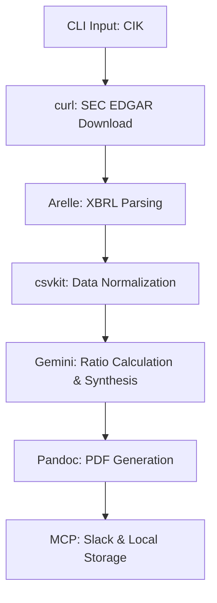

# Workflow Specification - SEC-Agent Pilot

## 1. Automation Sequence
The SEC-Agent follows a linear execution sequence, coordinated by the `rlm-integrator` via a shell script.

1.  **Input Trigger**: User executes `npx tsx src/sec-agent/cli.ts analyze --cik 0000320193`.
2.  **EDGAR Retrieval**: 
    - Construct SEC EDGAR URL based on CIK.
    - `curl` fetches the latest 10-K HTML/XML.
3.  **XBRL Extraction**:
    - `arelleCmdLine` parses the downloaded filing.
    - Output generated as `raw_facts.csv`.
4.  **Data Normalization**:
    - `csvkit` filters for `Revenues`, `NetIncomeLoss`, `StockholdersEquity`, `Debt`.
    - Data converted to `cleaned_facts.json`.
5.  **AI Synthesis**:
    - Gemini CLI (Deep Think) receives `cleaned_facts.json`.
    - AI calculates ratios and generates executive summary text.
6.  **Report Engineering**:
    - Pandoc compiles `cleaned_facts.json` + AI Summary + LaTeX Template into `report.pdf`.
7.  **Distribution**:
    - `gemini --mcp slack` posts summary.
    - File saved to `RLM/output/reports/`.

## 2. Process Flow (Mermaid)

## 3. Acceptance Criteria (AC)
- **AC-1**: Agent must correctly handle 10-digit CIKs with leading zeros.
- **AC-2**: Extraction must include at least 3 years of historical data if available.
- **AC-3**: PDF report must be generated using XeLaTeX with the standard finance template.
- **AC-4**: Ratios must be accurate within 0.01 margin of error compared to source data.
- **AC-5**: Slack post must include the "Recommendation" paragraph generated by AI.

## 4. Error Handling
- **Missing Filing**: If no 10-K found, return "ERROR: Filing not found for CIK [X]".
- **Arelle Failure**: If XBRL parsing fails, fall back to "Text-Only Analysis" via LLM parsing of HTML.
- **Rate Limit**: Implement a 10-second sleep between requests to comply with SEC Fair Access (10 requests/sec).
