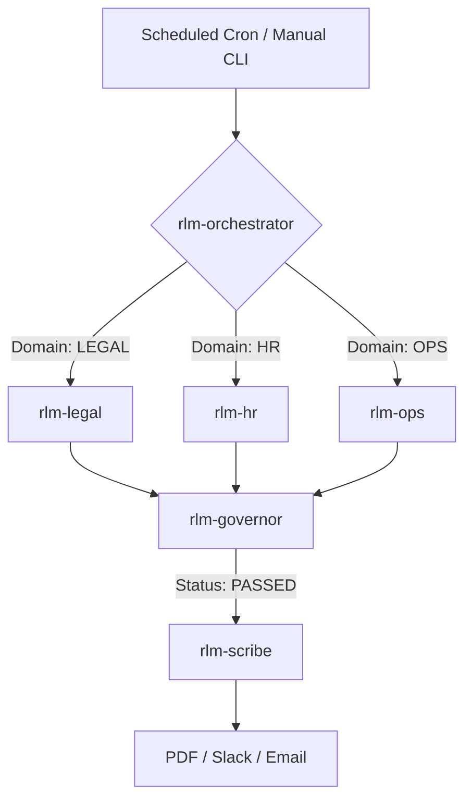

# Global Workflow Specification - Enterprise OPA Hub

## 1. Hub Orchestration Model
The OPA Hub operates as a "Command and Control" system. The Orchestrator receives a domain trigger and routes it to the specialized "Digital Worker."

## 2. Core Operational Modes
### A. Triage Mode (Real-time)
- **Trigger**: New item detected (Email, Slack mention, Log error).
- **Latency Target**: < 2 minutes.
- **Agent**: `flash-2.0` (Fast extraction).

### B. Deep-Think Mode (Batch)
- **Trigger**: Scheduled (Daily/Weekly) or manual batch request (10-Ks, Multi-contract audit).
- **Latency Target**: < 15 minutes per batch.
- **Agent**: `pro-2.5` (Deep reasoning).

## 3. Global Acceptance Criteria (GAC)
- **GAC-1**: All outputs must be saved to `RLM/output/[domain]/[date]/`.
- **GAC-2**: No artifact may be distributed if the `rlm-governor` flags a PII violation.
- **GAC-3**: Every automated run must generate a line in `RLM/progress/logs/hub-execution.csv`.
- **GAC-4**: Financial ratios must be validated against the `Analyst` logic before typesetting.

## 4. Error & Retry Strategy
- **Network Flakes**: 3 retries with exponential backoff (2s, 4s, 8s).
- **LLM Hallucinations**: Every extraction must cite a "Confidence Score." If < 0.7, route to manual review folder.
- **Credential Failure**: Immediate Slack alert to the IT Admin via `rlm-it`.
